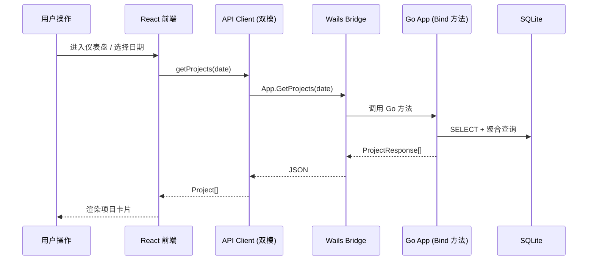
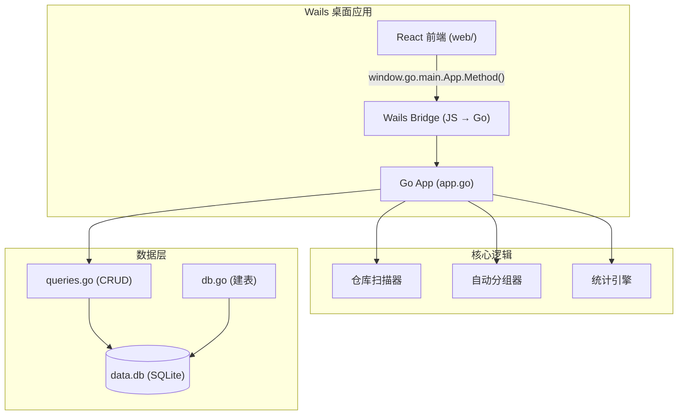

# GitBoard 架构文档

## 概述

GitBoard 是一个本地 Git 代码量统计与项目看板桌面应用。它扫描本地文件系统中的 Git 仓库，通过 `git log --shortstat` 统计每日代码变更量，按目录结构自动分组为项目，以仪表盘、趋势图和项目卡片的形式直观展示个人和团队的工作产出。

系统采用 **Wails v2 + Go 后端 + React 前端 + SQLite 嵌入式数据库** 架构，编译为单二进制可执行文件，支持 macOS、Windows、Linux 三大平台，无需额外安装运行时或数据库。

用户可自定义扫描根目录、每日代码量标准、Git 作者名，支持手动调整项目分组层级。每个项目可添加待办事项（Todo）和 Markdown 笔记，将日常开发任务的跟踪与代码量统计融为一体。

## 技术栈

**语言与运行时**
- Go 1.24 — 后端逻辑、数据库访问、Git 扫描
- TypeScript 5.4 + React 18 — 前端 UI
- CSS3 — 样式（无第三方 UI 框架）

**框架**
- Wails v2.13 — 桌面应用框架（Go 绑定 → JS 桥接）
- Vite 5.4 — 前端构建工具
- React Router 6.23 — 前端路由
- Chart.js 4.4 — 趋势图渲染
- marked — Markdown 渲染

**数据存储**
- SQLite（modernc.org/sqlite 纯 Go 驱动）— 嵌入式数据库

**基础设施**
- GitHub Actions — CI/CD，多平台构建矩阵
- vite-plugin-pwa — PWA 离线支持

## 项目结构

```
gitboard/
├── main.go                     # Wails 入口，embed 前端，生命周期管理
├── app.go                      # 20 个 Bind 方法（Go → JS 桥接）
├── app_test.go                 # Bind 方法集成测试
├── wails.json                  # Wails 项目配置
├── go.mod / go.sum             # Go 模块依赖
├── internal/
│   ├── db/
│   │   ├── db.go               # 数据库初始化 + DDL（5 张表 → 7 张表）
│   │   ├── queries.go          # CRUD 查询 + 数据模型定义
│   │   └── queries_test.go     # 14 个 DB 单元测试
│   ├── scanner/
│   │   ├── scanner.go          # 文件系统递归扫描 git 仓库
│   │   └── scanner_test.go     # 扫描器测试
│   ├── grouper/
│   │   ├── grouper.go          # 仓库自动分组为项目
│   │   └── grouper_test.go     # 分组逻辑测试
│   ├── stats/
│   │   ├── stats.go            # git log --shortstat 解析 + 工具函数
│   │   └── stats_test.go       # 统计逻辑测试
│   └── platform/
│       ├── platform.go         # 平台相关（路径/浏览器/日期）
│       └── platform_test.go    # 平台测试
├── web/
│   ├── src/
│   │   ├── api/client.ts       # 双模 API 客户端（Wails / HTTP）
│   │   ├── App.tsx             # 路由 + 导航栏
│   │   ├── pages/
│   │   │   ├── Dashboard.tsx   # 仪表盘页
│   │   │   ├── ProjectDetail.tsx # 项目详情页
│   │   │   └── Settings.tsx    # 设置页
│   │   ├── components/
│   │   │   ├── DatePicker.tsx  # 日期选择
│   │   │   ├── ProjectCard.tsx # 项目卡片
│   │   │   ├── ProjectPanel.tsx # 右侧面板容器
│   │   │   ├── SummaryBar.tsx  # 摘要条
│   │   │   ├── TodoSection.tsx # Todo 面板
│   │   │   ├── NoteSection.tsx # 笔记面板
│   │   │   └── TrendChart.tsx  # 趋势图
│   │   ├── styles/global.css   # 全局样式
│   │   └── main.tsx            # React 入口
│   ├── index.html              # HTML 入口
│   ├── package.json            # 前端依赖
│   ├── vite.config.ts          # Vite 配置
│   └── tsconfig.json           # TypeScript 配置
├── .github/workflows/release.yml # Wails 构建 CI
└── .monkeycode/specs/            # 功能规格文档
```

**入口点**
- `main.go` — 应用启动，初始化 DB → 创建 App → wails.Run()
- `app.go` — 20 个公开方法，Wails 自动桥接到 JS
- `web/src/main.tsx` — React 挂载入口
- `web/src/App.tsx` — 路由定义

## 子系统

### 数据库层 (internal/db)

**目的**: SQLite 数据库管理，包括建表、配置管理、CRUD 操作
**位置**: `internal/db/`
**关键文件**: `db.go`, `queries.go`, `queries_test.go`
**依赖**: modernc.org/sqlite
**被依赖**: app.go 中所有 Bind 方法

**表结构**:
- `scan_roots` — 扫描根目录列表
- `projects` — 项目分组记录
- `repositories` — 发现的 Git 仓库
- `daily_stats` — 每日代码统计
- `app_config` — 应用配置键值对
- `project_todos` — 项目待办事项
- `project_notes` — 项目 Markdown 笔记

### 仓库扫描器 (internal/scanner)

**目的**: 递归遍历文件系统，发现所有 `.git` 目录，返回仓库列表
**位置**: `internal/scanner/`
**关键文件**: `scanner.go`
**依赖**: 文件系统
**被依赖**: app.go → TriggerScan()

### 分组器 (internal/grouper)

**目的**: 将扫描到的仓库按目录层级自动分组为项目
**位置**: `internal/grouper/`
**关键文件**: `grouper.go`, `grouper_test.go`
**依赖**: scanner.RepoInfo
**被依赖**: app.go → TriggerScan()

### 统计引擎 (internal/stats)

**目的**: 执行 `git log --shortstat` 解析代码变更量，提供日期/工作日工具函数
**位置**: `internal/stats/`
**关键文件**: `stats.go`, `stats_test.go`
**依赖**: git CLI
**被依赖**: app.go → refreshAllStats / refreshProjectStats

### 平台适配 (internal/platform)

**目的**: 跨平台路径处理、Git 用户获取、浏览器打开、数据库路径
**位置**: `internal/platform/`
**关键文件**: `platform.go`, `platform_test.go`
**依赖**: 操作系统
**被依赖**: main.go

### Wails 桥接层 (app.go)

**目的**: 将 Go 方法通过 Wails Bind 暴露为 JS 可调用函数
**位置**: `app.go`
**关键文件**: `app.go`, `app_test.go`
**依赖**: internal/db, internal/stats, internal/scanner, internal/grouper
**被依赖**: web/src/api/client.ts

## 数据流



## 架构图


