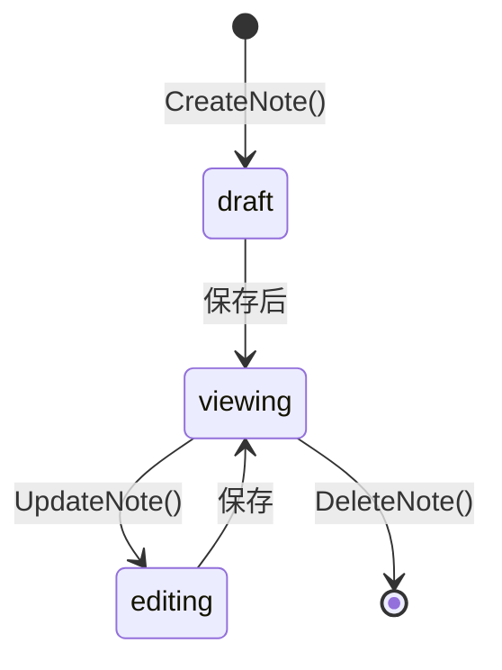

# Note（笔记）

Note 是关联到 GitBoard 项目的 Markdown 笔记，用于记录项目相关的思路、技术决策和备忘。

## 什么是 Note？

每个项目可以包含多条 Markdown 笔记。笔记内容支持 Markdown 格式，前端使用 `marked` 库渲染为 HTML 预览。编辑时使用纯文本 textarea 输入 Markdown 原文。

**关键特征**:
- 绑定到具体项目，不同项目的笔记互不干扰
- Markdown 格式（标题、列表、代码块、表格等）
- 创建时间和更新时间独立追踪
- 级联删除（项目删除时自动清理）

## 代码位置

| 方面 | 位置 |
|------|------|
| Go 模型 | `internal/db/queries.go` — `Note` |
| CRUD 操作 | `internal/db/queries.go` — ListNotes/CreateNote/UpdateNote/DeleteNote |
| Bind 方法 | `app.go` — ListNotes/CreateNote/UpdateNote/DeleteNote |
| 数据库 | `project_notes` 表 |
| 前端组件 | `web/src/components/NoteSection.tsx` |
| Markdown 渲染 | `marked` npm 包 |
| 前端 API | `web/src/api/client.ts` — listNotes/createNote/updateNote/deleteNote |

## 数据表结构

```sql
CREATE TABLE project_notes (
    id INTEGER PRIMARY KEY AUTOINCREMENT,
    project_id INTEGER NOT NULL,
    content TEXT NOT NULL,
    sort_order INTEGER DEFAULT 0,
    created_at DATETIME DEFAULT CURRENT_TIMESTAMP,
    updated_at DATETIME DEFAULT CURRENT_TIMESTAMP,
    FOREIGN KEY (project_id) REFERENCES projects(id) ON DELETE CASCADE
);
```

## 生命周期



## 不变量

1. **内容非空**: CreateNote 和 UpdateNote 的 content 不能为空
2. **时间戳**: 创建时 created_at = updated_at，更新时仅 updated_at 变化
3. **级联删除**: 项目删除时其所有笔记自动删除
