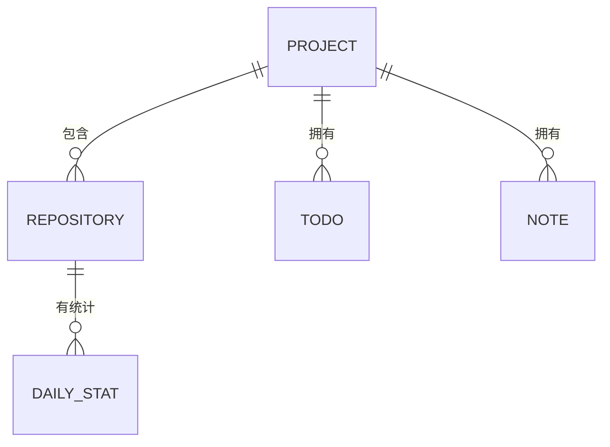

# Project（项目）

GitBoard 中的项目是将多个 Git 仓库按目录层级自动分组的逻辑节点。它不是一个真实的文件系统路径，而是多个相关仓库的聚合视图。

## 什么是 Project？

当 GitBoard 扫描本地文件系统时，发现的所有 Git 仓库会被分组器（grouper）按目录结构自动分组。例如：

```
~/Code/
├── work-project/         # Git 仓库 → 分组为 "Code"
│   └── .git/
├── side-project/         # Git 仓库 → 也分组为 "Code"
│   └── .git/
└── opensource/
    └── my-lib/           # Git 仓库 → 分组为 "Code/opensource"
        └── .git/
```

如果两个仓库在同一目录层级（如 `Code/` 下），它们属于同一个项目。

**关键特征**:
- 拥有名称（基于目录结构生成）、根路径、分组层级
- 可手动调整分组层级（向上合并 / 向下拆分）
- 关联多个仓库及其每日代码统计
- 关联 Todo 待办事项和 Markdown 笔记

## 代码位置

| 方面 | 位置 |
|------|------|
| Go 模型 | `internal/db/queries.go` — `Project` / `ProjectWithStats` |
| 响应模型 | `app.go` — `ProjectResponse` / `ProjectDetailResponse` |
| 数据库 | `projects` 表 |
| 分组逻辑 | `internal/grouper/grouper.go` |
| 前端卡片 | `web/src/components/ProjectCard.tsx` |
| 前端详情 | `web/src/pages/ProjectDetail.tsx` |

## 数据表结构

```sql
CREATE TABLE projects (
    id INTEGER PRIMARY KEY AUTOINCREMENT,
    name TEXT NOT NULL,
    root_path TEXT NOT NULL,
    level_override INTEGER DEFAULT 0,
    is_auto_grouped BOOLEAN DEFAULT 1,
    created_at DATETIME DEFAULT CURRENT_TIMESTAMP
);
```

## 关系


