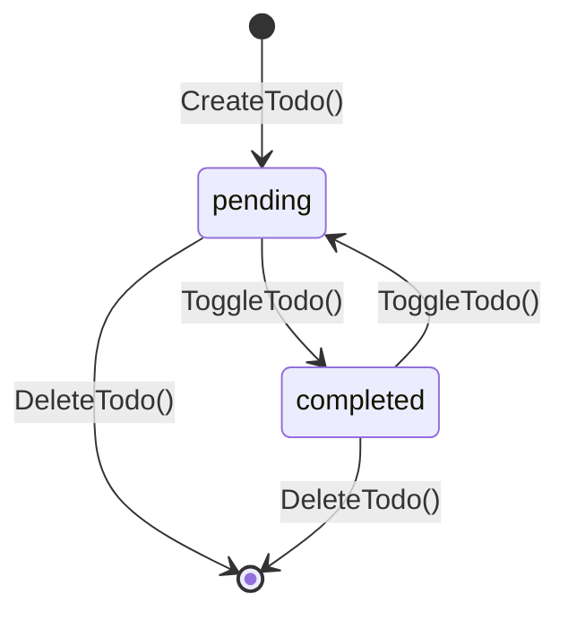

# Todo（待办事项）

Todo 是关联到 GitBoard 项目的待办事项，用于追踪日常开发工作中需要完成的任务。

## 什么是 Todo？

每个项目可以包含多个 Todo 项。每个 Todo 有标题、完成状态、排序位置，通过复选框一键切换完成状态。

**关键特征**:
- 绑定到具体项目，不同项目的 Todo 互不干扰
- 支持排序（上下按钮调整位置）
- 完成状态一键切换
- 仪表盘项目卡片显示未完成 Todo 计数徽标

## 代码位置

| 方面 | 位置 |
|------|------|
| Go 模型 | `internal/db/queries.go` — `Todo` |
| CRUD 操作 | `internal/db/queries.go` — ListTodos/CreateTodo/ToggleTodo/DeleteTodo/ReorderTodos |
| Bind 方法 | `app.go` — ListTodos/CreateTodo/ToggleTodo/DeleteTodo/ReorderTodos |
| 数据库 | `project_todos` 表 |
| 前端组件 | `web/src/components/TodoSection.tsx` |
| 前端 API | `web/src/api/client.ts` — listTodos/createTodo/toggleTodo/deleteTodo/reorderTodos |

## 数据表结构

```sql
CREATE TABLE project_todos (
    id INTEGER PRIMARY KEY AUTOINCREMENT,
    project_id INTEGER NOT NULL,
    title TEXT NOT NULL,
    completed BOOLEAN DEFAULT 0,
    priority INTEGER DEFAULT 0,
    sort_order INTEGER DEFAULT 0,
    created_at DATETIME DEFAULT CURRENT_TIMESTAMP,
    updated_at DATETIME DEFAULT CURRENT_TIMESTAMP,
    FOREIGN KEY (project_id) REFERENCES projects(id) ON DELETE CASCADE
);
```

## 生命周期



## 不变量

1. **排序连续性**: ReorderTodos 后 sort_order 从 0 开始连续递增
2. **级联删除**: 项目删除时其所有 Todo 自动删除（ON DELETE CASCADE）
3. **标题非空**: CreateTodo 的 title 不能为空或纯空白
