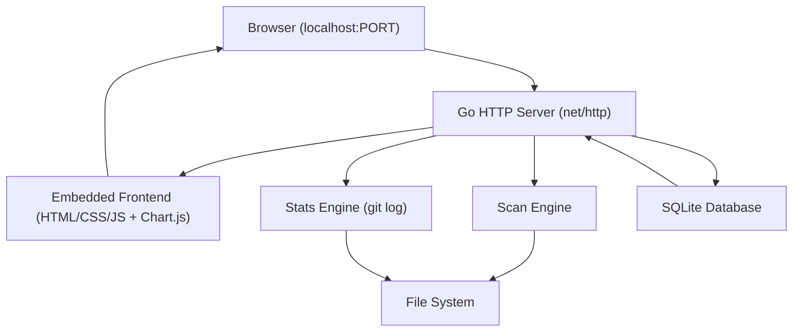
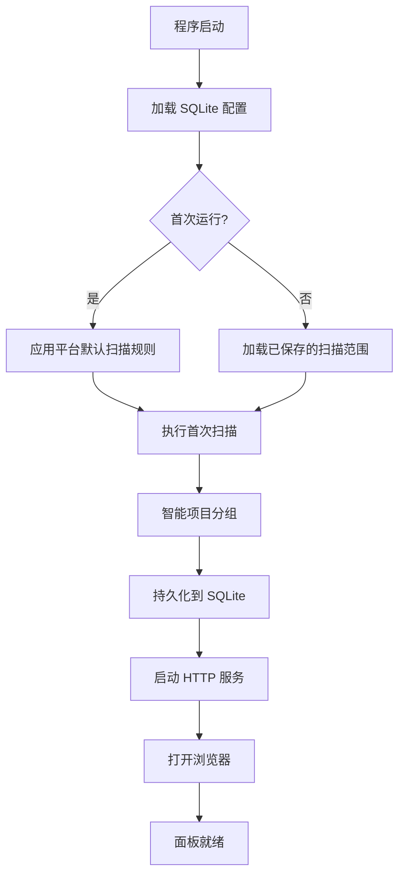

# Git Dashboard

Feature Name: git-dashboard
Updated: 2026-07-06

## 描述

将 CodeStat 从 Shell 脚本升级为 Go 编写的 Web 面板应用。编译为单个二进制文件，双击启动后自动打开浏览器展示项目仪表盘。自动扫描发现 Git 仓库，智能分组为项目，以卡片形式独立展示每个项目的提交量，支持趋势图表。

## 架构



系统采用单体架构：Go 后端内嵌前端静态资源，编译为单个可执行文件。后端通过 `net/http` 提供 REST API 和静态文件服务。扫描引擎遍历文件系统发现 Git 仓库，统计引擎通过调用 `git log` 命令获取提交数据。所有配置和统计缓存存储在 SQLite 中。

### 启动流程



## 组件与接口

### 1. HTTP API 层

所有 API 前缀为 `/api`。

| 方法 | 路径 | 说明 |
|------|------|------|
| GET | `/api/projects` | 获取所有项目列表及最近统计摘要 |
| GET | `/api/projects/:id` | 获取单个项目详情及历史趋势数据 |
| GET | `/api/projects/:id/stats?date=YYYY-MM-DD` | 获取指定日期的统计 |
| POST | `/api/projects/:id/level` | 调整项目目录级别 |
| POST | `/api/scan` | 触发重新扫描 |
| GET | `/api/config` | 获取当前配置 |
| PUT | `/api/config` | 更新配置（扫描范围、代码量标准等） |
| GET | `/api/summary?date=YYYY-MM-DD` | 获取汇总统计 |

### 2. 扫描引擎 (Scan Engine)

职责：遍历配置的根目录，发现所有 Git 仓库。

核心逻辑：
- 接收扫描根目录列表
- 递归遍历，找到所有 `.git` 目录
- 记录每个仓库的绝对路径和层级深度
- 返回仓库列表供分组引擎使用

性能保护：单次扫描深度上限 5 层，目录数量上限 10000。

### 3. 统计引擎 (Stats Engine)

职责：对单个 Git 仓库执行 `git log --shortstat` 并解析结果。

核心逻辑：
- 接收仓库路径、日期范围、可选作者过滤
- 调用 `git log --since --until --shortstat` 获取统计
- 解析输出得到：文件变更数、新增行数、删除行数
- 聚合多分支统计数据（如果有配置）

接口：
```
StatsResult { FilesChanged, LinesAdded, LinesDeleted, Author }
StatsEngine.Query(repoPath, date, author?) -> StatsResult
```

### 4. 项目分组引擎 (Group Engine)

职责：将发现的 Git 仓库列表分组为"项目"。

分组规则：
1. 同级目录下仅一个 Git 仓库：父目录作为项目，仓库直接关联
2. 同级目录下多个 Git 仓库：父目录作为项目，包含多个子仓库
3. 父目录本身也是 Git 仓库：父仓库独立为一个项目，子仓库另为一组

用户调整后覆盖自动分组结果，持久化到数据库。

### 5. 嵌入式前端

前端采用 React SPA，使用 Vite 构建，构建产物通过 Go `embed` 编译进二进制文件。

#### 技术栈
- React 18 + React Router v6
- Vite 构建工具
- Chart.js（趋势图）+ react-chartjs-2 封装
- CSS Modules 或 Tailwind CSS（样式方案）

#### 路由设计

| 页面 | 路由 | 说明 |
|------|------|------|
| 仪表盘 | `/` | 项目卡片网格，顶部汇总栏 |
| 项目详情 | `/project/:id` | 单项目详细统计 + 趋势图 |
| 设置 | `/settings` | 扫描范围配置、代码量标准 |

#### 仪表盘页面组件

- **顶部汇总栏**：仓库总数、总新增行、总删除行、个人贡献占比
- **日期选择器**：昨天 / 今天 / 自定义日期
- **项目卡片网格**：每个卡片显示项目名称、个人新增行数、删除行数、达标状态
- **扫描按钮**：手动触发重新扫描

#### 项目详情页面组件

- **项目信息**：名称、路径、包含的子仓库列表
- **目录级别调整**：向上/向下调整按钮
- **趋势图**：Chart.js 折线图，展示最近 N 天新增行数变化
- **分支选择器**：切换统计分支

#### 设置页面组件

- **扫描根目录列表**：增删根目录
- **代码量标准**：工作日每日目标行数
- **扫描深度**：最大扫描层级

## 数据模型

### SQLite 表结构

```sql
-- 扫描根目录配置
CREATE TABLE scan_roots (
    id INTEGER PRIMARY KEY AUTOINCREMENT,
    path TEXT NOT NULL UNIQUE,
    created_at DATETIME DEFAULT CURRENT_TIMESTAMP
);

-- 发现的 Git 仓库
CREATE TABLE repositories (
    id INTEGER PRIMARY KEY AUTOINCREMENT,
    path TEXT NOT NULL UNIQUE,          -- 绝对路径
    project_id INTEGER,                -- 所属项目 ID
    last_scanned_at DATETIME,
    FOREIGN KEY (project_id) REFERENCES projects(id)
);

-- 项目（分组后的展示单元）
CREATE TABLE projects (
    id INTEGER PRIMARY KEY AUTOINCREMENT,
    name TEXT NOT NULL,                -- 项目显示名称
    root_path TEXT NOT NULL,           -- 项目根目录（用户可调整）
    level_override INTEGER DEFAULT 0,  -- 用户调整的层级偏移
    is_auto_grouped BOOLEAN DEFAULT 1, -- 是否自动分组
    created_at DATETIME DEFAULT CURRENT_TIMESTAMP
);

-- 每日统计缓存
CREATE TABLE daily_stats (
    id INTEGER PRIMARY KEY AUTOINCREMENT,
    repository_id INTEGER NOT NULL,
    stat_date DATE NOT NULL,
    author TEXT NOT NULL,
    files_changed INTEGER DEFAULT 0,
    lines_added INTEGER DEFAULT 0,
    lines_deleted INTEGER DEFAULT 0,
    created_at DATETIME DEFAULT CURRENT_TIMESTAMP,
    FOREIGN KEY (repository_id) REFERENCES repositories(id),
    UNIQUE(repository_id, stat_date, author)
);

-- 应用配置
CREATE TABLE app_config (
    key TEXT PRIMARY KEY,
    value TEXT NOT NULL
);
-- 默认配置项：
-- daily_code_standard: 500
-- scan_depth: 5
-- scan_roots: JSON array of paths
```

## 正确性属性

- 同一仓库在同一天对同一作者的统计记录必须唯一（daily_stats 表的 UNIQUE 约束保证）
- 项目的 root_path 必须是文件系统中实际存在的路径
- 扫描结果必须可复现：相同扫描范围、相同时间点应得到相同仓库列表
- 用户手动调整的项目分组优先级高于自动分组

## 错误处理

| 场景 | 处理策略 |
|------|---------|
| 扫描根目录不存在 | 跳过该目录，日志记录警告，面板提示用户修正 |
| Git 命令不可用 | 启动时检测 git 是否在 PATH 中，缺失则弹窗提示安装 Git |
| SQLite 数据库损坏 | 自动重建数据库，重新扫描仓库（配置丢失需用户重设） |
| 仓库权限不足 | 跳过该仓库，标记为"无权限"，面板显示灰色卡片 |
| 超大仓库扫描超时 | 单仓库扫描超时 30 秒，超时则跳过并在面板标记 |

## 测试策略

- **单元测试**：扫描引擎的路径过滤逻辑、统计引擎的 git log 输出解析、分组引擎的分组规则
- **集成测试**：用测试用临时 Git 仓库验证完整的扫描-统计链路
- **手动验证**：在 Windows/macOS/Linux 三平台各验证一次完整流程

## 项目结构

```
git-dashboard/
├── main.go                 # 入口，启动 HTTP 服务并打开浏览器
├── go.mod
├── go.sum
├── internal/
│   ├── server/
│   │   ├── server.go       # HTTP 服务启动、路由注册
│   │   └── api.go          # REST API 处理函数
│   ├── scanner/
│   │   ├── scanner.go      # Git 仓库扫描引擎
│   │   └── scanner_test.go
│   ├── stats/
│   │   ├── stats.go        # git log 统计引擎
│   │   └── stats_test.go
│   ├── grouper/
│   │   ├── grouper.go      # 项目分组引擎
│   │   └── grouper_test.go
│   ├── db/
│   │   ├── db.go           # SQLite 初始化和迁移
│   │   └── queries.go      # 数据访问层
│   └── platform/
│       └── platform.go     # 平台检测（OS、默认路径、打开浏览器）
├── web/                    # React SPA (Vite)
│   ├── index.html
│   ├── package.json
│   ├── vite.config.ts
│   ├── src/
│   │   ├── main.tsx        # React 入口
│   │   ├── App.tsx         # 路由配置
│   │   ├── pages/
│   │   │   ├── Dashboard.tsx    # 仪表盘首页
│   │   │   ├── ProjectDetail.tsx # 项目详情
│   │   │   └── Settings.tsx     # 设置页面
│   │   ├── components/
│   │   │   ├── ProjectCard.tsx   # 项目卡片
│   │   │   ├── SummaryBar.tsx    # 顶部汇总栏
│   │   │   ├── DatePicker.tsx    # 日期选择器
│   │   │   └── TrendChart.tsx    # 趋势图（Chart.js）
│   │   ├── api/
│   │   │   └── client.ts        # API 请求封装
│   │   └── styles/
│   │       └── global.css
│   └── dist/               # Vite 构建输出（被 Go embed）
└── scripts/
    └── build.sh            # 跨平台编译（先 build 前端，再编译 Go）
```

### 构建流程

```
1. cd web && npm install && npm run build    # 构建 React SPA 到 web/dist/
2. go build -o git-dashboard .               # Go embed web/dist/ 编译二进制
```

前端资源通过 Go 的 `//go:embed web/dist/*` 指令嵌入。Chart.js 通过 npm 安装后随 Vite 打包进 dist，离线可用。

## 参考

[^1]: (statistics.sh) - 现有 CodeStat Shell 脚本的统计逻辑
[^2]: (.statistics.conf) - 现有配置文件格式
