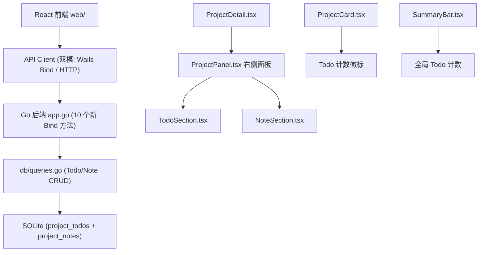
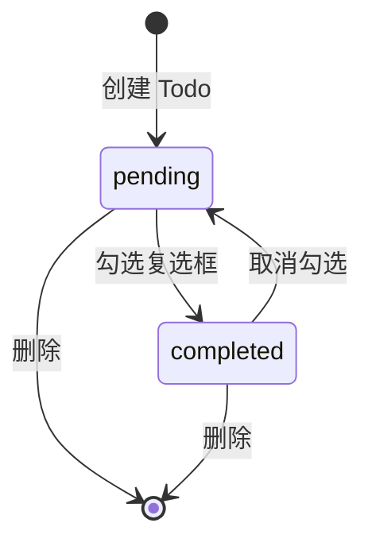
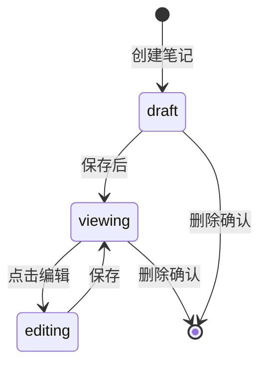

# 项目 Todo 与笔记功能

- Feature Name: project-todo-notes
- Updated: 2026-07-09

## 描述

为 GitBoard 的每个项目添加 Todo 待办和 Markdown 笔记功能。项目详情页改为左右分栏布局，左侧保留原有内容，右侧新增 Todo 和笔记面板。仪表盘项目卡片上显示未完成 Todo 计数徽标。

## 架构



### 数据流

1. 用户进入项目详情，`ProjectDetail` 调用 `ListTodos` + `ListNotes` 获取数据
2. 用户在右侧面板操作 Todo/笔记，调用对应 Bind 方法修改数据库
3. 数据库变更后前端立即刷新对应列表
4. 仪表盘加载时调用 `GetTodoCounts` 获取每个项目的未完成 Todo 数

### 页面布局变更

```
项目详情页 (左右分栏)
+---------------------------------------+--------------------------------------+
| 左侧 (60%)                             | 右侧 (40%)                            |
| - 返回按钮                             | [Todo 面板]                            |
| - 项目名称 / 路径 / 元信息              |  - 添加输入框                          |
| - 层级调整按钮                         |  - Todo 列表 (复选框 + 标题 + 时间)     |
| - 趋势图 (周/日切换)                    |  - 上下排序箭头                        |
| - 趋势图 (周/日切换)                    |  - 删除按钮                            |
| - 子仓库列表                           |                                       |
|                                       | [笔记面板]                             |
|                                       |  - 新建/编辑 Markdown 区域              |
|                                       |  - 笔记卡片 (渲染内容 + 时间)           |
|                                       |  - 编辑 / 删除按钮                     |
+---------------------------------------+--------------------------------------+
```

## 组件和接口

### Go 后端

#### 数据模型 (新增)

```go
// Todo 待办事项
type Todo struct {
    ID        int64  `json:"id"`
    ProjectID int64  `json:"project_id"`
    Title     string `json:"title"`
    Completed bool   `json:"completed"`
    Priority  int    `json:"priority"`
    SortOrder int    `json:"sort_order"`
    CreatedAt string `json:"created_at"`
    UpdatedAt string `json:"updated_at"`
}

// Note 笔记
type Note struct {
    ID        int64  `json:"id"`
    ProjectID int64  `json:"project_id"`
    Content   string `json:"content"`
    SortOrder int    `json:"sort_order"`
    CreatedAt string `json:"created_at"`
    UpdatedAt string `json:"updated_at"`
}

// TodoCount 项目 Todo 计数
type TodoCount struct {
    ProjectID int64 `json:"project_id"`
    Count     int   `json:"count"`
    Total     int   `json:"total"`
}
```

#### 数据库表 DDL

```sql
CREATE TABLE IF NOT EXISTS project_todos (
    id INTEGER PRIMARY KEY AUTOINCREMENT,
    project_id INTEGER NOT NULL,
    title TEXT NOT NULL,
    completed BOOLEAN DEFAULT 0,
    priority INTEGER DEFAULT 0,
    sort_order INTEGER DEFAULT 0,
    created_at DATETIME DEFAULT CURRENT_TIMESTAMP,
    updated_at DATETIME DEFAULT CURRENT_TIMESTAMP,
    FOREIGN KEY (project_id) REFERENCES projects(id) ON DELETE CASCADE
);

CREATE TABLE IF NOT EXISTS project_notes (
    id INTEGER PRIMARY KEY AUTOINCREMENT,
    project_id INTEGER NOT NULL,
    content TEXT NOT NULL,
    sort_order INTEGER DEFAULT 0,
    created_at DATETIME DEFAULT CURRENT_TIMESTAMP,
    updated_at DATETIME DEFAULT CURRENT_TIMESTAMP,
    FOREIGN KEY (project_id) REFERENCES projects(id) ON DELETE CASCADE
);
```

#### Bind 方法 (app.go 新增 10 个)

| 方法 | 签名 | 说明 |
|------|------|------|
| `ListTodos` | `(projectId int64) []Todo` | 获取项目 Todo 列表 |
| `CreateTodo` | `(projectId int64, title string) (*Todo, error)` | 创建 Todo |
| `ToggleTodo` | `(todoId int64) error` | 切换完成状态 |
| `DeleteTodo` | `(todoId int64) error` | 删除 Todo |
| `ReorderTodos` | `(todoIds []int64) error` | 更新排序 |
| `ListNotes` | `(projectId int64) []Note` | 获取项目笔记列表 |
| `CreateNote` | `(projectId int64, content string) (*Note, error)` | 创建笔记 |
| `UpdateNote` | `(noteId int64, content string) error` | 更新笔记 |
| `DeleteNote` | `(noteId int64) error` | 删除笔记 |
| `GetTodoCounts` | `() []TodoCount` | 获取各项目 Todo 计数 |

### 前端组件

#### 新增组件

| 组件 | 路径 | 说明 |
|------|------|------|
| `ProjectPanel` | `web/src/components/ProjectPanel.tsx` | 右侧面板容器，包含 TodoSection + NoteSection |
| `TodoSection` | `web/src/components/TodoSection.tsx` | Todo 添加、列表、排序、完成、删除 |
| `NoteSection` | `web/src/components/NoteSection.tsx` | 笔记创建、Markdown 编辑、渲染、删除 |

#### 修改组件

| 组件 | 改动 |
|------|------|
| `ProjectDetail.tsx` | 改为左右分栏布局，右侧嵌入 ProjectPanel |
| `ProjectCard.tsx` | 接收 `todoCount` prop，显示未完成 Todo 徽标 |
| `SummaryBar.tsx` | 新增全局 Todo 统计项 |
| `Dashboard.tsx` | 加载时获取 `GetTodoCounts`，传递给 ProjectCard |

#### API Client 新增方法

```typescript
// web/src/api/client.ts 新增
listTodos(projectId: number): Promise<Todo[]>
createTodo(projectId: number, title: string): Promise<Todo>
toggleTodo(todoId: number): Promise<void>
deleteTodo(todoId: number): Promise<void>
reorderTodos(todoIds: number[]): Promise<void>
listNotes(projectId: number): Promise<Note[]>
createNote(projectId: number, content: string): Promise<Note>
updateNote(noteId: number, content: string): Promise<void>
deleteNote(noteId: number): Promise<void>
getTodoCounts(): Promise<TodoCount[]>
```

#### Markdown 渲染方案

使用 `marked` 库进行 Markdown 渲染：

```bash
npm install marked
```

- 编辑时：`<textarea>` 输入原始 Markdown
- 预览时：`<div dangerouslySetInnerHTML={{ __html: marked(content) }} />`
- Toast 提示（绿色背景）显示操作结果

## 数据模型

### Todo 状态机



### Note 状态机



## 正确性约束

1. Todo 和笔记 SHALL 通过外键约束确保 project_id 引用的项目存在
2. ON DELETE CASCADE SHALL 确保项目删除时关联的 Todo 和笔记自动清理
3. `ToggleTodo` SHALL 原子地翻转 completed 字段并更新 updated_at
4. `ReorderTodos` SHALL 在一个事务中批量更新 sort_order 字段
5. `sort_order` SHALL 在新记录创建时自动取当前项目下最大值 + 1

## 错误处理

| 场景 | 处理方式 |
|------|---------|
| 项目不存在时创建 Todo/笔记 | 返回 `"project not found"` 错误 |
| Todo 标题为空 | 前端禁用添加按钮；后端返回 `"title is required"` 错误 |
| 笔记内容为空 | 前端禁用保存按钮；后端返回 `"content is required"` 错误 |
| 删除不存在的 Todo/笔记 | 静默成功（幂等操作） |
| 数据库写入失败 | 返回错误信息，前端 Toast 提示"操作失败，请重试" |

## 测试策略

### Go 后端测试

- `internal/db/` 单元测试：CRUD 操作的 SQL 正确性
- `app_test.go` 集成测试：Bind 方法的输入输出验证
- 边界测试：空字符串、大文本、并发创建

### 前端测试

- 手动验证 Todo 添加/完成/删除/排序流程
- 手动验证笔记创建/编辑/Markdown 渲染/删除流程
- 验证仪表盘 Todo 计数徽标正确性
- 验证项目删除后关联数据清理

## 新增依赖

### 前端

| 依赖 | 用途 | 大小 |
|------|------|------|
| `marked` | Markdown 渲染 | ~30KB minified |

### Go 后端

无新增 Go 第三方依赖。仅使用标准库 `database/sql` 和现有 `modernc.org/sqlite` 驱动。
