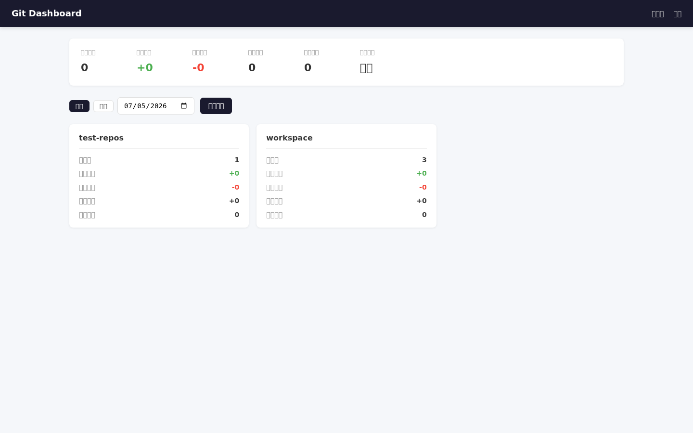
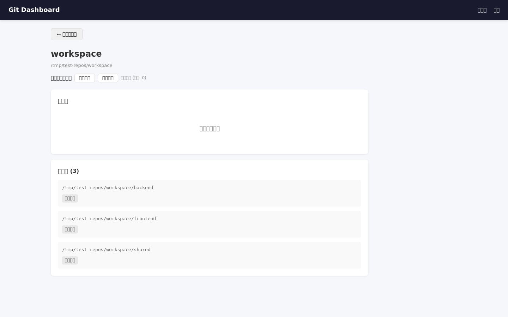

# GitBoard

自动发现本地所有 Git 仓库，以可视化 Web 面板独立展示每个项目的每日代码提交量。

[](https://go.dev)
[](https://react.dev)
[](https://web.dev/progressive-web-apps/)
[](./LICENSE)

## 截屏预览





## 功能特性

| 特性 | 说明 |
|------|------|
| 自动发现仓库 | 设置扫描根目录后递归发现所有 Git 仓库，平台自适应默认规则 |
| 可视化仪表盘 | 每个项目独立卡片展示新增/删除/净增行数，趋势折线图 |
| 智能项目分组 | 自动识别 Monorepo 与单仓库，支持手动调整目录级别 |
| 工作日检查 | 自定义每日代码量标准，未达标时面板告警提醒 |
| 跨平台单文件 | Go 编译为单个二进制，无运行时依赖，双击即用 |
| PWA 可安装 | 支持安装到桌面/主屏幕，获得原生应用体验 |

## 快速开始

### 下载安装

从 [Releases](https://github.com/sky-jiangcheng/CodeStat/releases) 下载对应平台的最新版本。

| 平台 | 一键安装 |
|------|---------|
| macOS / Linux | `curl -fsSL https://raw.githubusercontent.com/sky-jiangcheng/CodeStat/master/scripts/install.sh \| bash` |
| Windows | `iwr -useb https://raw.githubusercontent.com/sky-jiangcheng/CodeStat/master/scripts/install.ps1 \| iex` |

### 手动使用

```bash
# 下载后赋予执行权限
chmod +x gitboard

# 直接运行
./gitboard
```

启动后自动打开浏览器访问 `http://localhost:18731`，进入仪表盘。

### 配置

首次启动使用平台默认扫描规则：

| 平台 | 默认扫描范围 |
|------|-------------|
| Windows | 除系统盘(C:)外的所有磁盘根目录 |
| macOS | 当前用户 HOME 目录 |
| Linux | 当前用户 HOME 目录 |

在设置页面可修改扫描目录、代码量标准（默认 500 行/工作日）、扫描深度（1-10级，默认 5 级）。

配置存储在应用数据目录下的 `gitboard` 文件夹中：
- **Windows**: `%APPDATA%/gitboard/app_config.db`
- **macOS**: `~/Library/Application Support/gitboard/app_config.db`
- **Linux**: `~/.config/gitboard/app_config.db`

## 从源码构建

**前置要求**：Go 1.23+、Node.js 18+

```bash
# 安装前端依赖
cd web && npm install && cd ..

# 构建前端（编译为静态资源）
cd web && npm run build && cd ..

# 编译 Go 二进制（前端静态资源自动 embed）
go build -ldflags="-s -w" -o gitboard .

# 或使用构建脚本
bash scripts/build.sh
```

### 开发模式

```bash
# 终端1: 启动后端开发服务器
go run . -dev

# 终端2: 启动前端热更新开发服务器
cd web && npm run dev
```

前端开发服务器 `http://localhost:5173` 会将 `/api` 请求代理到后端 `http://localhost:18731`。

## 项目分组规则

GitBoard 使用智能分组算法自动识别项目边界：

| 场景 | 分组规则 |
|------|---------|
| 单仓库项目 | 父目录包含唯一仓库 -> 父目录即为项目 |
| MonoRepo | 父目录包含多个子仓库 -> 归为一个项目 |
| 嵌套仓库 | 父目录本身是 Git 仓库，其子目录也有仓库 -> 拆分为两个独立项目 |

通过设置页面的「项目分组级别」调整键，可以手动将整个父目录提级或将其子仓库拆分为独立项目。

## API 接口

| 方法 | 路径 | 说明 |
|------|------|------|
| GET | `/api/health` | 健康检查（返回数据库和版本状态） |
| GET | `/api/projects` | 项目列表，支持 `?date=YYYY-MM-DD` 查询指定日期 |
| GET | `/api/projects/{id}` | 项目详情（含仓库列表和历史统计） |
| GET | `/api/projects/{id}/stats` | 项目单日统计，支持 `?date=YYYY-MM-DD` |
| POST | `/api/projects/{id}/level` | 调整项目分组级别 `{"direction": "up"|"down"}` |
| POST | `/api/scan` | 触发仓库扫描和重新分组 |
| GET | `/api/config` | 获取全部配置和扫描根目录列表 |
| PUT | `/api/config` | 更新配置 `[{"key": "daily_code_standard", "value": "500"}]` |
| GET | `/api/summary` | 全局摘要统计，支持 `?date=YYYY-MM-DD` |

所有响应均为 JSON 格式。错误响应格式：`{"error": "描述信息"}`。

## 技术栈

| 层 | 技术 |
|----|------|
| 后端 | Go + net/http + SQLite (modernc.org/sqlite, 零 CGO) |
| 前端 | React 18 + TypeScript + Vite + Chart.js |
| PWA | vite-plugin-pwa + Workbox |
| 构建 | GitHub Actions 自动发布 Win/Mac/Linux 二进制 |

## 项目结构

```
├── main.go              # Go 程序入口，启动编排和优雅退出
├── internal/
│   ├── platform/        # 平台检测、浏览器打开、默认扫描规则
│   ├── db/              # SQLite 表结构和数据 CRUD
│   ├── scanner/         # Git 仓库递归扫描（深度/数量限制）
│   ├── stats/           # git log --shortstat 解析引擎
│   ├── grouper/         # 智能项目分组（Monorepo 识别）
│   └── server/          # REST API 服务（7 个端点 + 中间件）
├── web/                 # React SPA 前端（Vite + PWA）
│   └── src/
│       ├── pages/       # Dashboard / ProjectDetail / Settings
│       ├── components/  # ProjectCard / SummaryBar / DatePicker / TrendChart
│       └── api/         # API 客户端封装
├── docs/                # GitHub Pages 落地页（产品介绍）
├── scripts/             # 构建和安装脚本
└── .github/workflows/   # 多平台构建发布 + Pages 部署
```

## 安全设计

- **命令注入防护**：stats 引擎对 `date`、`author`、`branch` 参数进行正则格式校验，防止非法值传入 `git log` 命令行
- **请求体大小限制**：API 层限制请求体最大 1MB，防止内存耗尽
- **错误信息脱敏**：客户端返回统一错误消息，内部错误详情仅记录到服务端日志
- **配置键白名单**：`PUT /api/config` 仅允许 `daily_code_standard` 和 `scan_depth` 两个键的写入
- **URL 校验**：`OpenBrowser` 仅接受 `http://` 和 `https://` 协议的 URL
- **扫描边界控制**：扫描深度上限 10 级、目录数量上限 10000，防止遍历拒绝服务

## 常见问题

### Q: 仪表盘显示「暂未发现仓库」？

确保 Git 已安装且在 PATH 中，然后在设置页面配置包含 Git 仓库的扫描根目录，点击「重新扫描」。

### Q: 统计数据显示为零？

确认目标仓库在指定日期有提交记录。自动扫描只统计当天的数据，可通过日历组件切换日期查看历史。

### Q: 如何调整项目分组？

如果多个仓库被错误地归为一个项目（例如 Monorepo 识别不准确），进入项目详情页使用「级别调整」按钮提升或降低分组级别。

### Q: 端口被占用怎么办？

设置环境变量 `PORT=自定义端口` 后启动，或直接修改 `defaultPort` 常量重新编译。

## License

MIT
